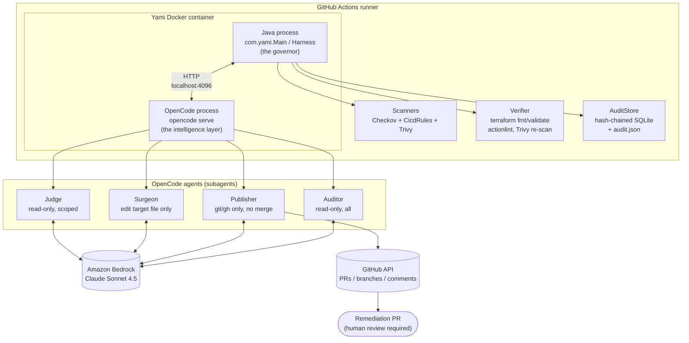
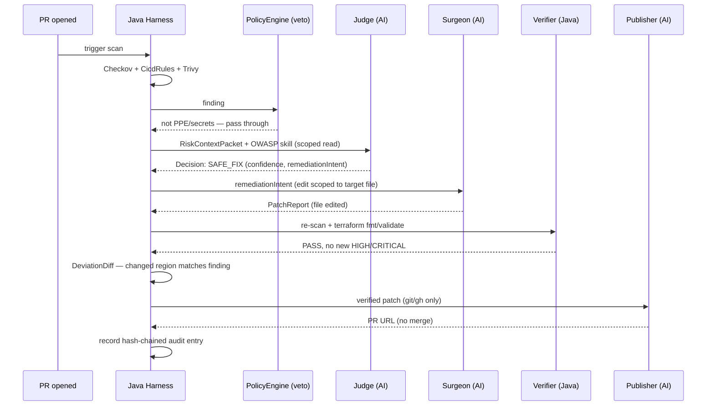
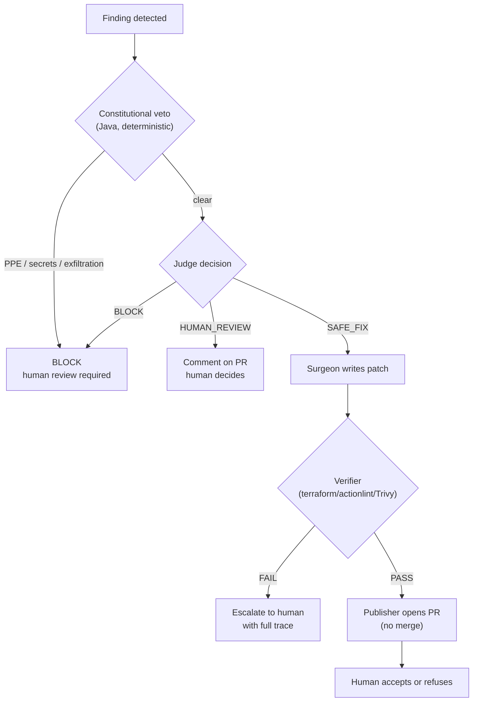

# Yami: AI-Powered Security Gate for IaC, CI/CD, and Supply Chain

> **Hackathon:** DevOps for GenAI - Ottawa 2026
> **Team:** Team 07
> **Theme:** Track 1 - Autonomous DevOps (AI-Powered CI/CD)

## Team

- George Fam
- Roger-Richard Djuiko'o
- Tam Hui

---

## Elevator Pitch

Yami is an AI-assisted security gate that scans your Infrastructure-as-Code and CI/CD pipelines for vulnerabilities, evaluates findings using OWASP-aligned intelligence, and proposes verified remediation patches, all without ever auto-merging. Java governs; AI proposes; humans dispose.

## Problem Statement

DevOps teams face a critical gap: security scanners (Checkov, Trivy) detect vulnerabilities in IaC and CI/CD, but remediation is manual, slow, and error-prone. Existing tools either:

- **Block deployments** without offering fixes (friction)
- **Apply blind patches** without verification (risk)
- **Require expert knowledge** of every framework (not scalable)

Yami bridges this gap by combining deterministic governance (Java) with contextual intelligence (AI agents) to produce **verified, scoped, and human-approved** remediation.

### Target Users

DevOps engineers and security engineers reviewing infrastructure/CI-CD pull requests; platform teams maintaining golden paths across many repos.

### Measurable Outcomes

| Metric | Target | Where it's tracked |
|---|---|---|
| Verification pass rate for SAFE_FIX decisions | > 95% | `Verifier.java`, recorded per-run in `audit.json` |
| Constitutional veto rate (PPE/secrets caught before any AI call) | Tracked every run, 0 bypasses | `PolicyEngine.java` via `AuditStore` |
| Patch deviation rate (Surgeon edits outside the finding's location) | 0% — any deviation is escalated, never silently merged | `DeviationDiff.java` |
| Time from finding to PR (SAFE_FIX path) | 1-3 minutes/finding | see [Runbook §4.2](docs/RUNBOOK.md#42-expected-runtime) |

These are the same indicators tracked in the [AI System Card's Monitoring section](docs/SYSTEM_CARD.md#7-monitoring); this table restates them as the project's headline success metrics.

## Architecture

Yami runs as a **single Docker container** inside a GitHub Actions runner. The container hosts two processes:

- **Java process** (`com.yami.Main`): The governor. Runs scanners (Checkov, CicdRules, Trivy), normalizes findings, hashes artifacts, orchestrates the pipeline, verifies patches deterministically, and assembles tamper-evident audit trails.
- **OpenCode process** (`opencode serve` or `opencode run`): The intelligence layer. Hosts 4 agents that communicate with Java via HTTP on `localhost:4096`:
  - **Judge** (read-only): Evaluates findings against OWASP skills, emits structured decisions
  - **Surgeon** (edit scoped): Implements remediation intent in the target file only
  - **Publisher** (git/gh only): Creates disposable branches and opens PRs. Never merges.
  - **Auditor** (read-only): Produces human-readable audit summaries

External dependencies: GitHub API (PRs), Amazon Bedrock API (AI inference), tool registries (for Docker build).

### Component Diagram



### Sequence Diagram — One SAFE_FIX Run



### Decision Flow



## How It Works

The pipeline executes 10 steps for each finding:

1. **Governance check:** Verify `.opencode/MANIFEST.json` integrity (chain-linked SHA-256)
2. **Scan:** Run Checkov + CicdRules on scoped paths (e.g., `**/*.tf`, `.github/workflows/**`)
3. **Context:** Build `RiskContextPacket` with findings, changed files, and git diff
4. **Route:** Map finding to OWASP skill(s) (`owasp-iac-security`, `owasp-cicd-top10`, etc.)
5. **Veto:** Constitutional veto in Java: PPE/secrets/exfiltration → BLOCK immediately (never sent to AI)
6. **Judge:** AI evaluates finding with scoped reads, emits `Decision` JSON (SAFE_FIX / HUMAN_REVIEW / BLOCK)
7. **Surgeon:** AI writes the patch in the target file only, emits `PatchReport` JSON
8. **Verify:** Deterministic verification: `terraform fmt/validate` + re-scan, or `actionlint` for workflows
9. **Deviate:** Java diff checks that changed regions intersect the finding location
10. **Publish:** If verified, open PR on disposable branch; if not, escalate to human review

All decisions, patches, and verifications are recorded in a hash-chained audit trail (`audit.json`).

## Quick Start

### Prerequisites

- Java 21 (Temurin)
- Maven 3.9+
- Docker
- GitHub repository with Actions enabled

### Local Build

```bash
# Clone
git clone <repo>
cd yami

# Build fat JAR
mvn package -DskipTests

# Build Docker image
make docker-build

# Run unit tests
make test-unit

# Generate SBOM
make sbom

# Regenerate governance manifest (after any .opencode/*.md change)
make manifest
```

### GitHub Action Integration

Yami's own repository runs two workflows against itself (see [`docs/RUNBOOK.md` §3.1](docs/RUNBOOK.md#31-github-action-integration) for full detail):

- **`yami.yml`** — full-scope gate, `workflow_dispatch`-only (a full run over the whole `fixtures/` tree takes ~15 min against real Bedrock, too slow to auto-gate every PR right now).
- **`yami-quick-test.yml`** — scoped to a small fixture subset, runs automatically on PRs that touch it, for fast iteration.

Minimal integration example for a consumer repository:

```yaml
name: Yami Security Gate
on:
  pull_request:
    types: [opened, synchronize]
permissions:
  contents: write
  pull-requests: write
jobs:
  yami:
    runs-on: ubuntu-latest
    steps:
      - uses: actions/checkout@v5
        with:
          fetch-depth: 0   # Harness needs origin/<base> for diffs
      - uses: ./
        with:
          github-token: ${{ secrets.GITHUB_TOKEN }}
          policy-file: policies/yami.yml
          aws-access-key-id: ${{ secrets.AWS_ACCESS_KEY_ID }}
          aws-secret-access-key: ${{ secrets.AWS_SECRET_ACCESS_KEY }}
          aws-region: us-east-1
```

### Action Inputs

| Input | Required | Default | Description |
|---|---|---|---|
| `github-token` | Yes | - | GitHub token for PR creation |
| `policy-file` | No | `policies/yami.yml` | Path to policy YAML |
| `audit-db` | No | `yami-audit.db` | SQLite audit database path |
| `scope` | No | `''` | Override scan paths |
| `replay-mode` | No | `false` | Enable replay mode for testing |
| `replay-file` | No | `replay.jsonl` | Replay file path |
| `aws-access-key-id` | No | `''` | AWS IAM access key scoped to `bedrock:InvokeModel` only (fallback path — OIDC is preferred) |
| `aws-secret-access-key` | No | `''` | AWS IAM secret key, paired with `aws-access-key-id` |
| `aws-session-token` | No | `''` | AWS session token, only for temporary/STS credentials |
| `aws-region` | No | `us-east-1` | AWS region for the Bedrock provider — must match `.opencode/opencode.json` |

## Security

- **Threat Model:** [`docs/THREAT_MODEL.md`](docs/THREAT_MODEL.md) - STRIDE analysis, attack scenarios, agent security matrix
- **Constitutional Veto:** Java `PolicyEngine` blocks PPE/secrets/exfiltration before AI sees them — deterministic, works today
- **Scoped Permissions (designed, not yet fully enforced):** Judge reads only finding dirs; Surgeon edits only target file; Publisher uses git/gh only — see [Known Limitations](#known-limitations-and-roadmap) for the current gap between this design and what OpenCode actually enforces at runtime
- **No Auto-Merge:** Branch protection + scoped token prevent unilateral merges
- **SHA256 Pins:** Base image, Trivy, OpenCode, and gh CLI binaries are SHA256-verified
- **Audit Trail:** Hash-chained SQLite + `audit.json` artifact with full trace

## AI Governance

- **System Card:** [`docs/SYSTEM_CARD.md`](docs/SYSTEM_CARD.md) - Purpose, risk classification, human oversight, model tracking
- **AI Usage Statement:** [`docs/AI_USAGE_STATEMENT.md`](docs/AI_USAGE_STATEMENT.md) - Models used, development assistance disclosure, prompt safety
- **4-Layer Oversight:** (1) Constitutional veto, (2) Judge HUMAN_REVIEW, (3) Verifier rejection, (4) Human PR approval
- **KillSwitch:** `YAMI_DISABLED=true` or token budget exceeded (1M tokens) stops all writes

## Operations

- **Runbook:** [`docs/RUNBOOK.md`](docs/RUNBOOK.md) - Deployment, failure modes, escalation, troubleshooting
- **SBOM:** [`docs/SBOM.md`](docs/SBOM.md) - Dependency inventory, pinning policy, supply chain controls
- **Self-Healing:** Yami scans its own repo (outdated tool pins in Dockerfile → PR → human accepts/refuses)
- **Replay Mode:** Test the pipeline without Bedrock by replaying recorded HTTP responses

## Theme Alignment

Yami aligns with **Track 1 - Autonomous DevOps** by demonstrating:

- **Autonomous security remediation:** AI agents evaluate and fix vulnerabilities without human intervention for clear cases
- **Governed autonomy:** 4 layers of human oversight prevent unilateral AI action
- **CI/CD integration:** Native GitHub Action, invoked on PRs (see [Known Limitations](#known-limitations-and-roadmap) — the full-scope gate is currently `workflow_dispatch`-only for runtime reasons; a scoped quick-test workflow runs automatically on PRs)
- **Operational evidence:** Tamper-evident audit trails, self-healing, and deterministic verification

## Project Structure

```
src/main/java/com/yami/
  Main.java              → Entrypoint (reads env vars, delegates to Harness)
  Harness.java           → Orchestrator: scan → veto → judge → surgeon → verify → publish → audit
  core/                  → Contracts (Finding, Decision, PatchReport, VerificationResult, RunResult, RiskContextPacket)
  scanner/               → CheckovAdapter, CicdRules, TrivyAdapter
  policy/                → PolicyEngine (constitutional veto), PolicyConfig (scope.scan_paths)
  verifier/              → Verifier (multi-strategy), TerraformStrategy, ActionlintYamlStrategy, TrivyStrategy, DeviationDiff, HclBlockReplacer
  judge/                 → BedrockClient (Live/Replay), Judge, DegradedPatchGenerator
  opencode/              → OpenCodeClient (HTTP API), OpenCodeServer, SkillRouter, PermissionInjector, ReplayHttpShim, SessionExporter
  github/                → GithubAdapter (git CLI + gh CLI, scoped token), ActionsOutput
  audit/                 → AuditStore (SQLite, hash-chained), TokenBudget, KillSwitch
  governance/            → GovManifestTool (generate/verify chain-linked SHA-256 manifest), GovernanceIntegrity
  investigator/          → Investigator (builds RiskContextPacket)

.opencode/
  opencode.json          → Bedrock provider config (env vars only, no keys)
  agents/                → judge.md, surgeon.md, publisher.md, auditor.md, spike-test.md
  skills/                → owasp-cicd-top10, owasp-iac-security, owasp-supplychain, owasp-llm-top10
  MANIFEST.json          → Chain-linked SHA-256 of all .md files

.github/workflows/
  ci.yml                 → Unit tests on push/PR
  security-scan.yml      → Trivy (gate + SARIF), Semgrep (SARIF), SBOM artifact
  yami.yml               → Full-scope Yami Security Gate, workflow_dispatch-only (self-healing)
  yami-quick-test.yml    → Small-scope Yami Security Gate, auto on fixtures/quick_test/** PRs

action.yml               → GitHub Action definition
policies/yami.yml        → scope.scan_paths + rule defaults
fixtures/                → safe_fix, human_review, block, rejected_patch, acte4bis_injection, acte6_selfheal, quick_test
```

## Build Commands

```bash
# Build fat jar (Maven shade)
mvn package -DskipTests

# All tests (requires checkov + terraform + trivy + actionlint on PATH)
make test

# Unit tests only (no external tools)
make test-unit

# Docker build (must run mvn package FIRST)
make docker-build

# Governance manifest (regenerate after ANY .opencode/*.md change)
make manifest

# SBOM
make sbom

# Clean
make clean
```

## Technology and AI-Tool Inventory

**Runtime stack:** Java 21 (Temurin), Maven, Docker, SQLite (audit store), Checkov 3.3.13, Terraform 1.15.8, Actionlint 1.7.12, Trivy 0.74.0, gh CLI 2.98.0, OpenCode 1.18.21, Amazon Bedrock (Claude Sonnet 4.5, `amazon-bedrock/us.anthropic.claude-sonnet-4-5-20250929-v1:0`), GitHub Actions. Full pin/version detail: [`docs/SBOM.md`](docs/SBOM.md).

**Development AI-tool stack** (tools used to build Yami itself — distinct from the runtime AI stack above): OpenCode (coding agent) and Claude CLI (Claude Sonnet 5) for code generation, architecture, and documentation. Full disclosure of what AI was and wasn't used for during development: [`docs/AI_USAGE_STATEMENT.md`](docs/AI_USAGE_STATEMENT.md).

## Known Limitations and Roadmap

Yami tracks its engineering backlog as GitHub issues, not in this README, so the single source of truth stays current. The master submission-readiness tracker is [issue #37](https://github.com/George-Fam/DevOps-for-GenAI---Ottawa-2026---Team-07/issues/37); the full bug/gap backlog is issues `#4`–`#24`.

**The one gap that matters most for evaluating the security claims in this repo:** OpenCode's per-invocation permission scoping (Judge's scoped reads, Surgeon's single-file edit) is the *designed* control but is **not yet functionally enforced end-to-end** — confirmed via live testing against real Bedrock. Full technical detail, evidence, and what still catches a bad patch anyway (the deterministic Verifier and the no-merge rule don't depend on this layer): [`docs/THREAT_MODEL.md` §3.1](docs/THREAT_MODEL.md#31-known-gap-per-invocation-permission-scoping-is-not-yet-enforced), tracked as [issue #4](https://github.com/George-Fam/DevOps-for-GenAI---Ottawa-2026---Team-07/issues/4) (P0).

**Demo integrity (P-15):** replay mode (`replay-mode: true`) replays recorded Bedrock HTTP responses through the real Java pipeline for offline/degraded demos — clearly labeled `fallbackMode: true` in the audit trail, never presented as a live run. A full `pull_request`-triggered run of `yami.yml` against a real external PR has not yet been confirmed end-to-end (issue #18); `yami-quick-test.yml`'s scoped runs and the fixture-driven "Six Acts" in [`docs/THREAT_MODEL.md` §4](docs/THREAT_MODEL.md#4-attack-scenarios-the-six-acts) are what's been exercised so far.

Other open items worth knowing about: the Auditor's "tamper-evident hashes" section in its PR summary template references finding/skill hashes the Harness doesn't currently compute, so it may fabricate placeholder-looking values (issue #10); `TrivyStrategy`'s rescan comparison isn't a true before/after diff yet, unlike `TerraformStrategy`'s (issue #14); Actionlint's binary isn't SHA256-pinned yet, unlike the other tool binaries (tracked in [`docs/SBOM.md` §2.3](docs/SBOM.md#23-known-gaps)).

## Documentation

| Document | Purpose | Rubric |
|---|---|---|
| [`docs/THREAT_MODEL.md`](docs/THREAT_MODEL.md) | Security threats and mitigations | Security (15%) |
| [`docs/SYSTEM_CARD.md`](docs/SYSTEM_CARD.md) | AI governance and responsible AI | AI Governance (10%) |
| [`docs/AI_USAGE_STATEMENT.md`](docs/AI_USAGE_STATEMENT.md) | AI transparency and disclosure | AI Governance (10%) |
| [`docs/RUNBOOK.md`](docs/RUNBOOK.md) | Operations and troubleshooting | Reliability (10%) |
| [`docs/SBOM.md`](docs/SBOM.md) | Supply chain inventory | Supply chain (P-14) |

## Submission Checklist

Mapped to the *DevOps for GenAI Hackathon 2026* Guidelines Handbook §6 (20-item checklist). Tracked live as [issue #37](https://github.com/George-Fam/DevOps-for-GenAI---Ottawa-2026---Team-07/issues/37).

| # | Item | Evidence |
|---|---|---|
| 1 | Project name and selected theme | Header of this README |
| 2 | Elevator pitch | [Elevator Pitch](#elevator-pitch) |
| 3 | Problem statement and target users | [Problem Statement](#problem-statement), [Target Users](#target-users), [Measurable Outcomes](#measurable-outcomes) |
| 4 | Architecture diagram | [Component / Sequence / Decision-flow diagrams](#component-diagram) |
| 5 | Working demo / URL or reproducible run | [Quick Start](#quick-start); no hosted URL — reproduce via `make docker-build` + the Action; see [Known Limitations](#known-limitations-and-roadmap) for what's confirmed live vs. fixture/replay-driven |
| 6 | GitHub repository | This repository |
| 7 | Technology and AI-tool inventory | [Technology and AI-Tool Inventory](#technology-and-ai-tool-inventory) |
| 8 | AI usage disclosure | [`docs/AI_USAGE_STATEMENT.md`](docs/AI_USAGE_STATEMENT.md) |
| 9 | Security threat model | [`docs/THREAT_MODEL.md`](docs/THREAT_MODEL.md) |
| 10 | Security/adversarial test evidence | [`docs/THREAT_MODEL.md` §4, the "Six Acts"](docs/THREAT_MODEL.md#4-attack-scenarios-the-six-acts), esp. Act 4bis (prompt injection) |
| 11 | Governance / AI system card | [`docs/SYSTEM_CARD.md`](docs/SYSTEM_CARD.md) |
| 12 | CI/CD pipeline evidence | `.github/workflows/{ci,security-scan,yami,yami-quick-test}.yml` |
| 13 | Testing evidence | `make test-unit` / `make test`; `src/test/java/com/yami/**` |
| 14 | Observability evidence | [`docs/RUNBOOK.md` §9](docs/RUNBOOK.md#9-logs-and-audit) — structured logs, `audit.json`, hash-chained SQLite |
| 15 | SBOM/dependency inventory | [`docs/SBOM.md`](docs/SBOM.md); generated in CI (`sbom` job) |
| 16 | Secrets scan / repository hygiene evidence | `.github/workflows/security-scan.yml` (Trivy SCA gate, Semgrep SAST) |
| 17 | Runbook / setup instructions | [`docs/RUNBOOK.md`](docs/RUNBOOK.md), [Quick Start](#quick-start) |
| 18 | Demo video or live presentation | Scheduled separately from this repo |
| 19 | Known limitations and future roadmap | [Known Limitations and Roadmap](#known-limitations-and-roadmap) |
| 20 | Team member list | [Team](#team) |

## License

TBD - Hackathon project (Team 07, DevOps for GenAI Ottawa 2026)

---

*Built with Java 21, OpenCode, and Amazon Bedrock. Governed by humans, assisted by AI.*
